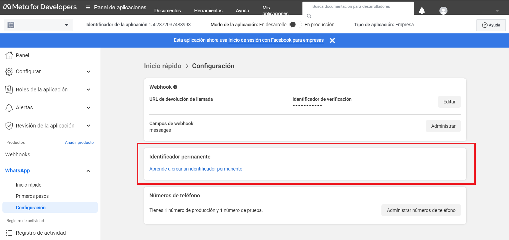
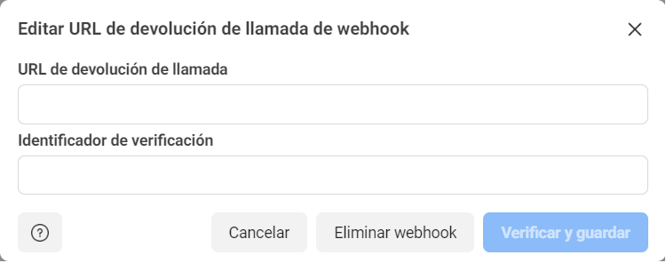
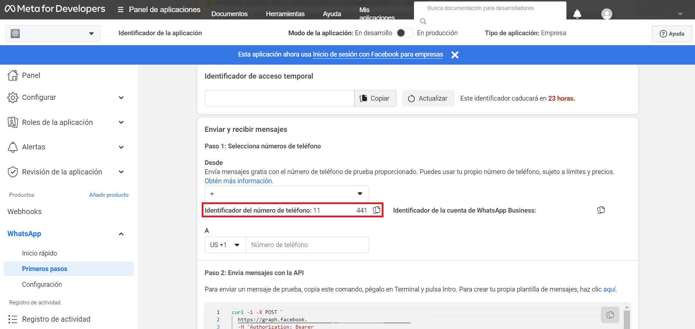

<h1 align="center">Node.js Bot Whatsapp business API Cloud</h1>

<div align="center">

[](https://www.npmjs.com/)
[](https://developers.facebook.com/docs/whatsapp)
[](https://nodejs.org/)
[](https://www.meta.com/)


</div>

<details close><summary><h1>English documentation</h1></summary>

### 🚀 **You will take your business to the next level** by providing a 100% professional and automated service hosted in the cloud thanks to fly.io and you will be able to connect to the database with the Supabase service in postgres SQL.

# Getting started
- ### [Functions of bot](#function_of_bot)
- ### [Get started](#get_started)
- ### [Not Support api](#not_support_api)
- ### [Security and Env](#security_and_Env)
- ### [Connection to Meta Api](#connection_to_meta_api)

<a name="function_of_bot"></a>

## The functions of the bot are:

<details close><summary><h3>✅ Respond and process</h3></summary>

> * ### *Text message.*
> * ### *Images.*
> * ### *Files.*
> * ### *Videos.*
> * ### *Locations.*
> * ### *Stickers.*
> * ### *Contacts.*
</details>

<details close><summary><h3>✅ Send</h3></summary>

> * ### *Text messages.*
> * ### *Lists.*
> * ### *Buttons.*
> * ### *Contacts.*
> * ### *Audios.*
> * ### *Localitations.*
> * ### *Stickers.*
> * ### *Images.*
> * ### *Files.*
> * ### *Videos.*
</details>

### ✅ *Send a list of products of the business with the price.*

### ✅ *Respond with the user name of client.*

### ✅ *Client Can buy in WhatsApp.*

### ✅ *Save the data in **_Supabase_** or another database provide server with support **_Postgres SQL_**.*

### ✅ *Support multilanguage, no limit or restriction*

### 🕞 More functions be added in the future...

<a name="not_support_api"></a>

## Not support for the moment the api:

### ❌ Send group messages
### ❌ Administrate member of groups
### ❌ Send poll to user or group

<a name="get_started"></a>

# Get Started

### Clone the repository:

``` bash
git clone https://github.com/TomasS-R/chatbotWhatsAppApiBusiness.git
```

### Install the requirements:

``` bash 
npm install
```

<a name="security_and_Env"></a>

# Security and Env configuration:

### The Bot has a **env** file (ExampleEnv.txt) for protect the keys of the api cloud and supabase service.

### ⚠️Important⚠️:
### You need to modify the name of the file **_ExampleEnv_** to **_.env_** Please check this out.

### In this file you must fill in the corresponding fields by connecting to the server, in my case I used fly.io and to set the keys I used the command:

``` bash
fly secrets set SUPER_SECRET_KEY=password1234
```

### SUPER_SECRET_KEY = your secret key or the key the service provide you.
### password1234 = your password or the password the service provide you.

#### ℹ️ You can see more information of env configurations of fly.io in his page:
[](https://fly.io/docs/rails/the-basics/configuration/#:~:text=in%20multiple%20environments.-,Secret%20Variables,-Environment%20variables%20that)

<a name="connection_to_meta_api"></a>

# Configure connection to Meta api cloud business 🦾

### In this module we will see how to configure the access and interaction with the meta service and the bot so that they can work correctly. 

### `TOKEN=`



#### You can obtain this Permanent **_Token_** in the developers page of meta and you can configure the AccessToken in webhook option:
#### Meta for developers account > My applications > WhatsApp > Configuration.

### `ACCESSTOKEN=`



#### The Access Token is generated so that meta can check the correct connection with the bot, **_you can place it randomly_**, either with:
- #### *Numbers*
- #### *Letters*
- #### *Upper and lower case*

#### The URL that requests us meta is the one of our server in which our bot is hosted, once the url and the AccessToken are valid it confirms it and the connection is established.

### `IDPHONE=`



#### You can obtain the **_IDPHONE_** in the developers page of meta:
#### Meta for developers account > My applications > WhatsApp > First Steps.

### 🤖 The connection is now successfully established between your bot and the server ✅.

### More documentation coming soon...
</details>

<details close><summary><h1>Español documentacion</h1></summary>

### 🚀 **Llevarás tu negocio al siguiente nivel** prestando un servicio 100% profesional y automatizado alojado en la nube gracias a fly.io y podrás conectarte a la base de datos con el servicio Supabase en postgres SQL.

# Getting started
- ### [Funciones del bot](#funciones_del_bot)
- ### [Comenzar](#comenzar)
- ### [No soportado por la api](#no_soportado_api)
- ### [Seguridad y entornos de desarrollo](#seguridad_y_Env)
- ### [Conexión con la api de Meta](#conexion_con_meta_api)

<a name="funciones_del_bot"></a>

## Funciones del bot:

<details close><summary><h3>✅ Respuestas y procesos</h3></summary>

> * ### *Mensajes de texto.*
> * ### *Imagenes.*
> * ### *Archivos.*
> * ### *Videos.*
> * ### *Localizaciones.*
> * ### *Stickers.*
> * ### *Contactos.*
</details>

<details close><summary><h3>✅ Envios</h3></summary>

> * ### *Mensajes de texto.*
> * ### *Listas.*
> * ### *Butones.*
> * ### *Contactos.*
> * ### *Audios.*
> * ### *Localizaciones.*
> * ### *Stickers.*
> * ### *Imagenes.*
> * ### *Archivos.*
> * ### *Videos.*
</details>

### ✅ *Enviar una lista de productos de la empresa con el precio.*

### ✅ *Responder con el nombre de usuario del cliente.*

### ✅ *El cliente puede comprar en WhatsApp.*

### ✅ *Guarde los datos en **_Supabase_** o en otra base de datos que proporcione un servidor con soporte en **_Postgres SQL_**.*

### ✅ *Soporta multilenguaje, sin limite o restriccion*

### 🕞 Mas funciones seran añadidas en el futuro...

<a name="no_soportado_api"></a>

## No soportado por la api:

### ❌ Enviar mensajes a grupos
### ❌ Administrar miembros de grupos
### ❌ Envia una encuesta al usuario o grupo

<a name="comenzar"></a>

# Comenzar

### Clonar el repositorio:

``` bash
git clone https://github.com/TomasS-R/chatbotWhatsAppApiBusiness.git
```

### Instalar los requerimientos:

``` bash 
npm install
```

<a name="seguridad_y_Env"></a>

# Seguridad y Entornos de desarrollo:

### El bot tiene un archivo **env** (ExampleEnv.txt) para proteger las claves de la api cloud y el servicio de supabase.

### ⚠️Importante⚠️:
### Debes modificar el nombre del archivo **_ExampleEnv_** a **_.env_** Por favor revisa esto.

### En este archivo IEn este archivo debes rellenar los campos correspondientes conectándote al servidor, en mi caso utilicé fly.io y para establecer las claves utilicé el comando:

``` bash
fly secrets set SUPER_SECRET_KEY=password1234
```

### SUPER_SECRET_KEY = tu clave secreta o la clave que te provee tu servicio.
### password1234 = Tu contraseña o la contraseña que te provee tu servicio.

#### ℹ️ Puedes ver mas informacion sobre las configuraciones de env de fly.io en su web:
[](https://fly.io/docs/rails/the-basics/configuration/#:~:text=in%20multiple%20environments.-,Secret%20Variables,-Environment%20variables%20that)

<a name="conexion_con_meta_api"></a>

# Configure la conexión con la api de Meta api cloud business 🦾

### En este módulo veremos cómo configurar el acceso y la interacción con el meta servicio y el bot para que funcionen correctamente. 

### `TOKEN=`


#### Puedes obtener este **_Token_** permanente en la página de desarrolladores de meta y puedes configurar el AccessToken en la opción webhook:
#### Meta para desarrolladores cuenta > Mis aplicaciones > WhatsApp > Configuración.

### `ACCESSTOKEN=`


#### El Access Token se genera para que Meta pueda comprobar la correcta conexión con el bot, **_puedes colocarlo aleatoriamente_**, ya sea con:
- #### *Numeros*
- #### *Letras*
- #### *Mayusculas y minusculas*

#### La URL que nos solicita meta es la de nuestro servidor en el que está alojado nuestro bot, una vez la url y el AccessToken son válidos lo confirma y se establece la conexión.

### `IDPHONE=`


#### Puedes obtener el **_IDPHONE_** en la página de desarrolladores de meta:
#### Meta para desarrolladores cuenta > Mis aplicaciones > WhatsApp > Primeros pasos.

### 🤖 La conexión se ha establecido correctamente entre tu bot y el servidor  ✅.

### Mas documentacion proximamente...
</details>